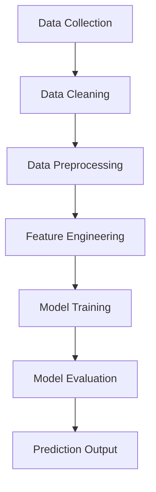

# Employee-Salary-Prediction
Here’s a **polished, attractive, and recruiter-friendly README.md** for your project 👇

---

# 💼 Employee Salary Prediction System

> A Machine Learning project that predicts employee salary categories based on demographic and professional attributes.

---

## 📌 Overview

The **Employee Salary Prediction System** is designed to analyze employee data and predict whether an individual earns above or below a certain salary level.

This project showcases the practical use of machine learning in **HR analytics**, helping organizations make informed and data-driven decisions.

---

## 🚀 Key Highlights

✨ Clean and structured ML workflow
📊 Real-world dataset handling
🤖 Multiple model implementation
📈 Performance evaluation and comparison

---

## 🎯 Problem Statement

Salary prediction is an important task in data analytics as it helps in:

* Understanding income distribution
* Identifying key factors affecting salary
* Supporting hiring and compensation decisions

This project aims to build a reliable model to classify salary levels accurately.

---

## 🧠 Tech Stack

| Category      | Tools / Libraries          |
| ------------- | -------------------------- |
| Language      | Python                     |
| Data Handling | Pandas, NumPy              |
| Visualization | Matplotlib, Seaborn        |
| ML Models     | Scikit-learn               |
| Environment   | Jupyter Notebook / VS Code |

---

## ⚙️ Project Workflow



---

## 📊 Features Considered

* Age
* Education
* Occupation
* Workclass
* Hours per week
* Marital Status (if used)

---

## 🏗️ Machine Learning Models

* Logistic Regression
* Decision Tree
* (Optional) Random Forest

✔️ Models are evaluated based on accuracy and performance metrics.

---

## 📈 Results

* Achieved good prediction accuracy
* Identified important features influencing salary
* Built a scalable and reusable ML pipeline

---

## 🖥️ How to Run

```bash
# Clone the repository
git clone https://github.com/Abhishekphatak19/Abhishekphatak19-Employee-Salary-Prediction.git

# Navigate to folder
cd Abhishekphatak19-Employee-Salary-Prediction

# Install dependencies
pip install -r requirements.txt

# Run project
jupyter notebook
```

---

## 🌟 Future Scope

* 🔹 Deploy as a web application (Streamlit)
* 🔹 Use advanced models like XGBoost
* 🔹 Add real-time salary prediction interface
* 🔹 Improve accuracy with larger datasets

---

## 📷 Demo (Optional)

*Add screenshots or output images here to make your project more attractive*

---

## 🤝 Contribution

Contributions, suggestions, and improvements are always welcome!

---

## 📄 License

This project is for educational and learning purposes.

---

## 👨‍💻 Author

**Abhishek Phatak**

---

## ⭐ Show Your Support

If you like this project, feel free to ⭐ the repository!

---

If you want, I can also:
🔥 Make a **very premium README (with badges, icons, GIFs)**
🔥 Add **LinkedIn-ready project description**
🔥 Help you **deploy this project (Streamlit / website)**
